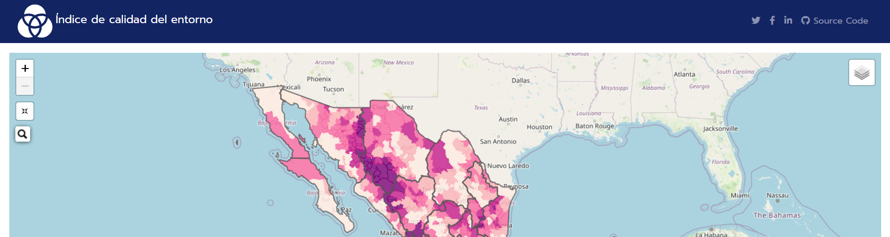

<!-- README.md is generated from README.Rmd. Please edit that file -->

<!-- badges: start -->

[](https://github.com/r-lib/usethis/actions/workflows/R-CMD-check.yaml)

<!-- badges: end -->

```{r, include = FALSE}
knitr::opts_chunk$set(
  collapse = TRUE,
  comment = "#>"
)
#usethis::use_readme_rmd()
```

# Índice de Calidad del Entorno

Este proyecto proporciona un visualizador del mapa dinámico del Índice de Calidad del Entorno a nivel municipal, 2020. 

## Descripción

El Índice de Calidad del Entorno (ICE) es una herramienta que permite evaluar y visualizar la calidad del entorno en diferentes municipios. Este índice se basa en diversos factores de equipamiento, rezagos económicos, y accesibilidad que afectan la calidad de vida de los habitantes.

## Visualizador del Mapa Dinámico

Puedes acceder al visualizador del mapa dinámico del ICE a nivel municipal a través del siguiente enlace:

[**Visualizador del ICE 2020 a nivel municipal**](https://dvillasanao.github.io/ICE_2020_Leaflet/Municipio/R/05_ICE_2020.html)

<html>
<body>
  <a href = "https://dvillasanao.github.io/ICE_2020_Leaflet/Municipio/R/05_ICE_2020.html" target="_blank">

  </a>
</body>
</html>

## Contenido

- [Descripción](#descripción)
- [Visualizador del Mapa Dinámico](#visualizador-del-mapa-dinámico)
- [Cómo usar](#cómo-usar)
- [Datos](#datos)
- [Contribuciones](#contribuciones)

## Cómo usar

Para usar el visualizador del ICE, sigue estos pasos:

1. Haz clic en el enlace proporcionado en la sección de [Visualizador del Mapa Dinámico](#visualizador-del-mapa-dinámico).
2. Navega por el mapa interactivo para explorar los diferentes municipios y sus índices de calidad del entorno.
3. Utiliza las herramientas del mapa para acercar, alejar y obtener más detalles sobre cada área.

## Datos

Los datos utilizados para generar el Índice de Calidad del Entorno provienen de diversas fuentes oficiales y han sido procesados para proporcionar una evaluación precisa y actualizada de la calidad del entorno a nivel municipal.

---

Desarrollado por [dvillasanao](#).

